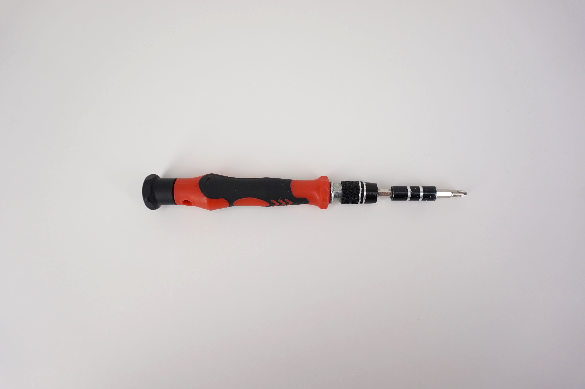
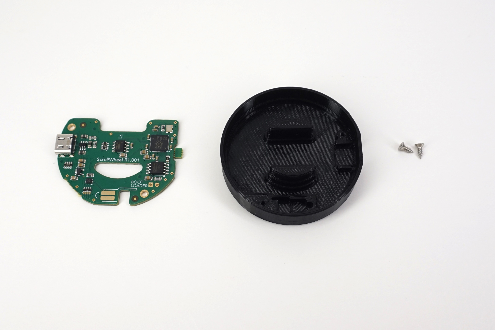
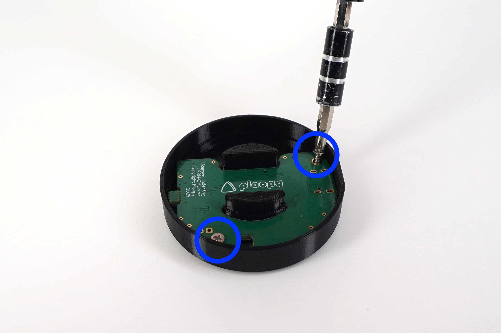
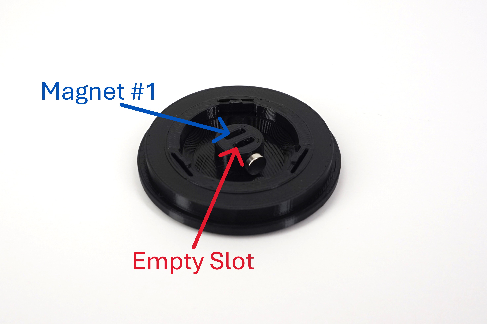
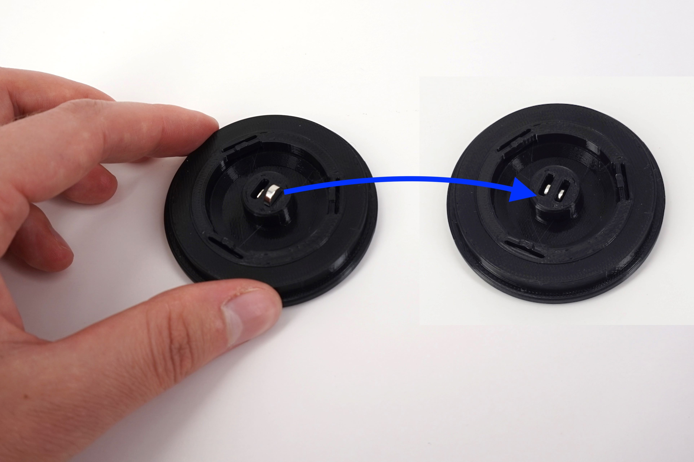

# Ploopy Knob Assembly Instructions

## Main Instructions

In this section, you'll go over how to build a Ploopy Knob. This assumes you've sourced the parts yourself following the designs in this repository.

Here's how these instructions are structured*:

- 💡 Comments with a lightbulb are good information to know.
- ➡️ Comments with an arrow are commands. Execute them when you encounter them.
- ✅ Comments with a checkmark are verification steps. Check what they tell you to check, and if it's all good, move on.
- 📷 Comments with a camera are references to photos. Check the corresponding image for guidance.

Most steps have photos, so if you need some additional visual help, consult the images.

*\* Thanks to [schneems](https://github.com/schneems) for his [great suggestions on how to write documentation](https://github.com/ploopyco/headphones/issues/37).*

### Step 1

- ➡️ Get a #1 Phillips head screwdriver (or similar; you're looking for a small-ish screwdriver here).
- 💡 A pair of needle-nose pliers and a pair of tweezers are optional, but they'll make future steps easier.

|  |
|:--:|
| *Figure 1: Necessary tools* |

### Step 2

- ➡️ Grab the plastic knob base, the PCB, and two #1 Phillips head plastic screws.
- ➡️ Place the PCB in the base of the knob. Make sure to align the USB port with the slot for it in the base. 📷 *See Figure 2.2.*
- ➡️ Screw in the two screws. 📷 *See Figure 2.3.*

|  |
|:--:|
| *Figure 2.1: Parts needed for Step 2* |

|  |
|:--:|
| *Figure 2.2: Align the USB port on the PCB with the slot in the base* |

|  |
|:--:|
| *Figure 2.3: Attach the PCB with two screws* |

### Step 3

- ➡️ Grab the top half of the knob and two magnets.
- ➡️ Take ONE of the two magnets and insert it into one of the slots. A little force is required to press this first magnet into its slot. 📷 *See Figure 3.2.*
- 💡 Do not insert magnet #2 until explicitly told to do so.
- 💡 Magnet #1 when inserted should be free to rattle around a bit inside its slot before magnet #2 is installed. This is how you know magnet #1 is fully pressed in.
- 💡 The orientation of both magnets needs to be verified before inserting magnet #2. When both magnets are inserted correctly, they'll attract each other, not repel each other.
- ➡️ Without inserting it, place magnet #2 on the outside of the cylinder, closest to the empty slot. It should stick to the cylinder due to the magnetic attraction. 📷 *See Figure 3.3.*
- 💡 Now, magnet #2 is oriented correctly. It just needs to be slipped into the slot.
- ➡️ Without rotating magnet #2, slip it into its slot and press it in.
- 💡 When both magnets are fully seated, you should hear a click as the two magnet snap together from inside their respective slots.

|  |
|:--:|
| *Figure 3.1: Parts needed for Step 3* |

|  |
|:--:|
| *Figure 3.2: Insert magnet #1 into the slot* |

|  |
|:--:|
| *Figure 3.3: Align magnet #2 with the first* |

|  |
|:--:|
| *Figure 3.4: Press magnet #2 into its slot* |

### Step 4

- ➡️ Gently press the bearing into the top half of the knob.
- 💡 Press with your thumbs all around the circumference of the bearing to make sure it's seated all the way into the slot.

|  |
|:--:|
| *Figure 4: Press the bearing into the top half of the knob* |

### Step 5

- ➡️ Take the top half of the knob, place it above the bottom half, making sure the two circles line up. Press the top half into the bottom half.
- ➡️ You're done! Plug it in and take it for a spin!

|  |
|:--:|
| *Figure 5: Press the knob halves together* |
